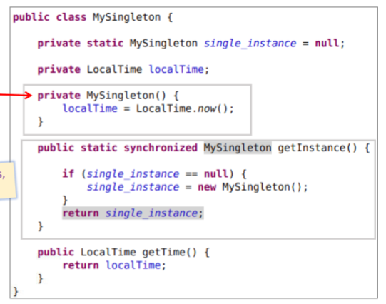
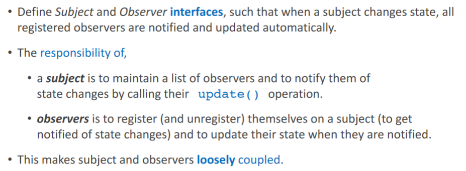
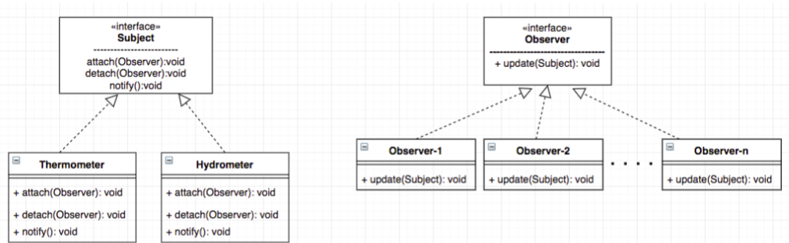

# Revisiting OOP

[C# is an object oriented language docs](https://learn.microsoft.com/en-us/dotnet/csharp/tour-of-csharp/types)

I feel like I should revisit OOP
- See my **knowledge docs** [`COMP2511 OOP`](./assets/COMP2511%20OOP.docx)
- I want to explore the idea of "Why was OOP invented?"

### Why was the OOP paradigm created?

- https://news.ycombinator.com/item?id=24651580

### Quick OOP review

- Classes: Support inheritance
- Structs: Primarily for storing data
- Interface: Define constract that can be implemented by classes and structs.
- Enum: Set of constant values

### [Design patterns](https://refactoring.guru/design-patterns/catalog)

- **Singleton Pattern**: The Singleton pattern ensures that **only one instance** of a class exists throughout the application. It can be useful for managing global game objects or systems like a game manager or audio manager.
  - Implementation: 
    - Make default constructor private
    - Static creation method that creates the first object or returns a reference to the singleton object
  - Use cases:
    - Log files
    - Database class (for one database)
    - Game world
- 
- **Factory Pattern**: The Factory pattern provides a way to create objects without exposing the creation logic to the client. It can be used when you need to instantiate different types of objects based on certain conditions or parameters.
  - Implementation:
    - Define a method to create objects instead of using the object's constructor directly
    - Subclass the factory to create different subclassed objects
  - Use case:
    - Resolve dependencies by ensuring the dependencies are resolved in the factory class
    - Encapsulate complex initialization logic
    - Payment gateways for different providers
    - Data Loaders for different formats
    - Auth providers for different auth providers
- **Observer Pattern**: The Observer pattern establishes a one-to-many dependency between objects, where changes in one object trigger updates in other objects. This pattern is useful for event handling or creating systems that require communication between different components.
  - Use cases:
    - Any event driven programming
  - 
  - 
- **Command Pattern**: The Command pattern encapsulates a request as an object, allowing you to parameterize clients with different requests, queue or log requests, and support undo operations. It can be used for input handling, AI behaviors, or implementing an undo/redo system.
  - Implementation:
    - Put business logic in a class implementing a Command interface that executes the functionality you want
  - Use cases:
    - Different UI elements reusing commands
- **Strategy Pattern**: The Strategy pattern defines a family of algorithms, encapsulates them, and makes them interchangeable. It enables you to select algorithms at runtime, providing flexibility and avoiding code duplication. This pattern is useful for implementing different behaviors or strategies for AI or game mechanics.
- **Object Pooling Pattern**: The Object Pooling pattern pre-creates and maintains a group of reusable objects to improve performance by avoiding instantiation and destruction overhead. It is commonly used for managing bullets, particle effects, or other frequently created/destroyed objects.
- **Component Pattern**: The Component pattern is commonly used in Unity, where game objects are composed of smaller reusable components. Each component encapsulates a specific behavior or functionality, which can be easily added or removed from objects at runtime.
- **Flyweight Pattern**: The Flyweight pattern reduces memory usage by sharing common data across multiple objects. It can be useful for managing large sets of similar objects with shared properties, such as trees, rocks, or other environmental objects.
- **State Pattern**: The State pattern allows an object to alter its behavior when its internal state changes. It is useful for managing complex state machines or implementing behavior that depends on the state of an object.

### Design patterns to use with .NET

- **Strategy, observer, factory, command patterns** are shared with Unity and .NET
  - **Why**? Write some examples for how these patterns are used similarly and how they differ between game dev and web dev.
- **MVC (Model-View-Controller) Pattern**: The MVC pattern separates the concerns of data representation (Model), user interface (View), and application logic (Controller). It provides a clear separation of responsibilities and facilitates modular development and testability.
- **Repository Pattern**: The Repository pattern abstracts the data access layer, providing a consistent interface for interacting with data storage (e.g., databases). It helps decouple the application logic from specific data access technologies, making it easier to switch between different implementations.
- **Dependency Injection (DI) Pattern**: DI is a technique that allows you to inject dependencies into an object rather than letting the object create them itself. It promotes loose coupling and facilitates testability and flexibility. In .NET, you can use frameworks like ASP.NET Core's built-in DI container or third-party libraries like Autofac or Ninject.
- **Decorator Pattern**: The Decorator pattern allows you to add additional behavior or functionality to an object dynamically. It enables you to extend the functionality of classes without modifying their core implementation. This pattern can be useful for adding cross-cutting concerns like caching, logging, or authorization to your web server components.
- **Proxy Pattern**: The Proxy pattern provides a surrogate or placeholder object that controls access to another object. It can be useful for implementing caching, load balancing, or security mechanisms in your web server.
- **Template Method Pattern**: The Template Method pattern defines the skeleton of an algorithm in a base class and allows subclasses to override specific steps of the algorithm. It can be useful for defining a common structure for request handling, allowing subclasses to provide specific implementations.

### Design By Contract (DbC)

[Building bug-free O-O software: An Introduction to Design by Contract](https://www.eiffel.com/values/design-by-contract/introduction/)

**Code Contracts are not maintained (not recommended) in .NET Core.**
- Alternative is to use [**Nullable Reference Types**](https://learn.microsoft.com/en-us/dotnet/csharp/nullable-references)
- I think pre/post conditions and invariants are still useful for documentation and readability purposes.
- Don't have to have strict type checking but defining clauses will help me formalize my system

[DBC in .NET framework](https://learn.microsoft.com/en-us/dotnet/framework/debug-trace-profile/code-contracts) --> No longer supported by .NET Core

How can you build reliable Object-Oriented software?
- static typing --> Catches inconsistencies
- Garbage collection
- Reuseability? --> How do you validate the problem
- Security

:::tip Quality software
> When quality is pursued, productivity follows

Carlo Ghezzi, Dino Mandrioli and Mehdi Jazayeri, SoftwareEngineering, Prentice Hall 1991
:::

**What is Design by Contract?
**
- We specify **a contract between a routine and a potential caller**. It contains the most important information that can be given about the routine: what each party in the contract must guarantee for a correct call, and what each party is entitled to in return.
- To achieve this, we specify some  **clauses**:
  - `require` : Input conditions or preconditions
  - `ensure` : Output conditions or postconditions
  - `rescue` : Mechanism to handle exceptions with strategies such as **retry**

**What are the benefits of Design By Contract?
**
- If we do not specify what a module should do, what **guarantees** do we have that a module will do it? (Law of exluded miracles)
- **Seamlessness** : We want to use a single notation and single set of concepts throughout the software lifecycle
- **Standardised documentation**: I define a short form of documentation below which strips all implementation information but retains the contract
- **Handling exceptions** : Exceptions are an inability to handle the contract
  - Responses to exceptions under the DbC paradigm
    - **Retrying**: Restore invariant and attempt again using the new strategy
    - **Organized panic**: Restore invariant, terminate and report failure
    - **False Alarm**: Continue (maybe take corrective measures)? This is the most unlikely scenario though.

```
class DICTIONARY [ELEMENT]
feature
	put (x: ELEMENT; key: STRING) is
			-- Insert x so that it will be retrievable
			-- through key.
		require
			count <= capacity
			not key.empty 
		ensure
			has (x)
			item (key) = x
			count = old count + 1
		end

	... Interface specifications of other features ...

invariant
	0 <= count
	count <= capacity
end
```

**Invariants**: General clause which applies to an entire set of contracts defining a class
- **Class invariants**: Describe properties which hold over all instances of a class
- Why? We use class invariants for configuration management and regression testing

What to watch out for using DbC?

- dishonest subcontracting: If you strengthen the precondition or weaken the postcondition, this can lead to disaster
- Should tests be the contract?
- Some problems can't be easily expressed as a contract.
- Pre/Post conditions get exponentially more difficult with concurrency.
  - Do I need a model checker to verify the pre/post conditions? I can use promela

