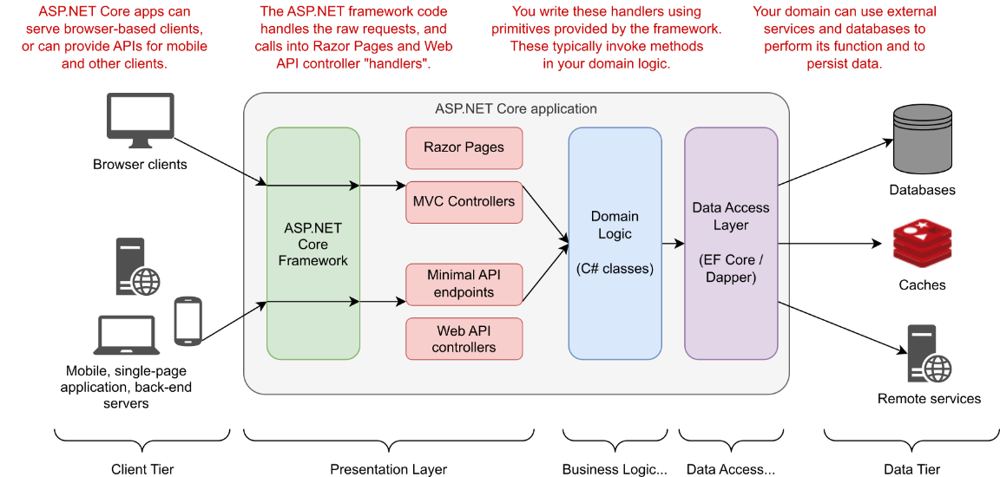

# .NET Core

[Textbook - ASP.NET Core in Action 3rd Edition](https://www.manning.com/books/asp-net-core-in-action-third-edition)

[History of .NET Notes](../web/04_history_of_dotnet.md)

### What can I build with .NET Core?

Paradigms build on top of ASP.NET Core.
- Minimal APIs—Simple HTTP APIs that can be consumed by mobile applications or browser-based single-page applications.
- Web APIs—An alternative approach to building HTTP APIs that adds more structure and features than minimal APIs.
  -  **.NET WebAPI with React** is used for providing a REST API for a client-side Single Page Application (SPA)
    - Is WebAPI and OpenAPI compatible? [Yes.](https://learn.microsoft.com/en-us/aspnet/core/tutorials/web-api-help-pages-using-swagger?view=aspnetcore-7.0) WebAPI can be setup with Swagger (OpenAPI) documentation
- gRPC APIs—Used to build efficient binary APIs for server-to-server communication using the gRPC protocol.
  - RPC framework: Execute procedures on a remote computer through requests
- Razor Pages—Used to build page-based server-rendered applications.
  - Use the pages paradigm when your content is structured around action pages --> Like "Contact", "About Us", or "Login"
- MVC controllers—Similar to Razor Pages. Model-View-Controller (MVC) controller applications are for server-based applications but without the page-based paradigm.
- Blazor WebAssembly—A browser-based single-page application framework that uses the WebAssembly standard, similar to JavaScript frameworks such as Angular, React, and Vue.
- Blazor Server—Used to build stateful applications, rendered on the server, that send UI events and page updates over WebSockets to provide the feel of a client-side single-page application but with the ease of development of a server-rendered application
  - Downside is that it requires maintaining an internet connection to keep the websocket open

Multiple paradigms can be combined within a single application

### What do I want to know about ASP.NET Core?

- I want to know more about the MVC paradigm
  - I need to improve my understanding of the traditional **MVC paradigm**
    - View Engine: By default supports Razor and ASPX (Web Forms)
    - Model --> Entity framework
    - Controller --> Typical register routes stuff
    - Why was MVC invented? Why was WebAPI invented?
  - Blazor / Razor templating is equivalent to Django / Jinja2 templating?
    - What's the difference between razor paradigm and mvc? 
- I want to understand the **tradeoffs** between WebAPI, MVC, Razor & Blazor
  - I want to scope my requirements and pick the correct technology BASED on those requirements
- **Architecture design**: abstracting the application and domain logic so it can be used elsewhere
  - https://github.com/jasontaylordev/CleanArchitecture/tree/net6.0
  - https://code-maze.com/cqrs-mediatr-in-aspnet-core/#:~:text=How%20MediatR%20facilitates%20CQRS%20and,is%20an%20important%20limitation%20here. 
  - What are the well-established design patterns that ASP.NET is built around?
    - Pipelines from Node.js (2009)
    - MVC from Ruby on Rails (2002) --> .NET MVC released in (2009) 
    - ? --> gRPC
    - ? --> Blazor / Razor

### .NET Technology Overview

- **Kestrel**: Default websever bundled with .NET
  - Improved performance from ASP.NET windows IIS webservers
- **Nginx**: Reverse proxy I'm familiar with
  - Use reverse proxy with webservers because they can handle health checks, load balancing, retries and failover. Separatation of converns with Kestrel only concerned with generating HTTP responses 
- **NuGet**: Package manager for .NET
  - Equivalent to npm (js), maven (java), etc.

### Versioning of .NET

- ~~I'm using .NET 6.0~~ I've chosen .NET 7.0
- Features in .NET 7.0 that make me consider migrating
  - Output caching middleware (no redis!)
  - Rate limiting middleware
  - JSON support in EF Core 7.0
- .Net Framework
  - ASP.NET Web Forms --> Tied to old System.Web.dll and IIS, so not available on ASP.NET Core
    - Can reploace with blazor server which is similar to web forms application model
    - Or slowly introduce WebAPI concepts to Web Forms and transition that way
  - Windows Communication Foundation (WCF): Only partially supported in ASP.NET Core
    - gRPC does WCF's contract-based RPC style without WCF itself
  - ASP.NET MVC has similar features to ASP.NET Core but different underlying architecture
    - No direct replacement for some features
