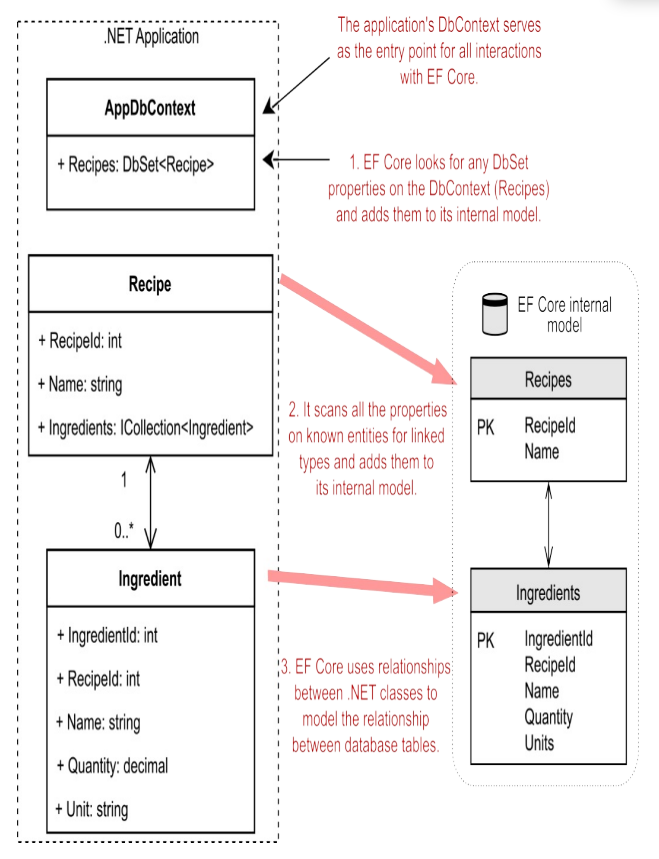

# Lessons from Django

I already have experience with the MVC paradigm through previous websites I've built with Django, Flask, and FastAPI.

- .NET supports hot reload from v6.0

### Razor Scaffolds vs Django Templates

- Razor Pages: HTML template page with associated C#
  - Layouts: The layout page controls the layout of each page
    - Imports HTML, Javascript and StyleSheets
    - Rendered where `@RenderBody()` is called
    - Layout property is set in `Pages/_ViewStart.cshtml`
  - Partials:
  - Templates:
  - Tag Helpers: Enable server-side code to render HTML. Denoted by the `@` prefix in the `.cshtml` file
- cshtml files : Markup engine language for the razor engine used to render serverside HTML pages. Consider these the equivalent to template files in Django or Jinja2.
  - cshtml.cs files:
  - `@page` and `@model YourApp.Pages.YourFolder.YourPage` directives transition html to razor page
    - `@page` : Can pass in route params
    - `@model YourApp.Pages.YourFolder.YourPage` specifies the type of model that is passed to the page
- `@RenderBody` : placeholder where all the page-specific views show up, wrapped in the layout page
- `@{...}` : The `{` and `}` characters enclose a block of c# code
  - Can iterate using forloops using `@for`
    - for loops can iterate over data in the ViewData directory. HTML elements are implicitly returned
- The `ViewData` dictionary : K/V store that passes data to the view
- `@namespace` Set the namespace in the template
  - Should I structure namespace based on file structure?

### Razor Page Models

Implementation of the **Page Controller pattern**, where there is a one-to-one mapping between pages and their controllers
- `public IActionResult OnGet()`: Initializes state for the page
- `public async Task<IActionResult> OnPostAsync`: Run when the page posts form data
- `Page()` method: Creates a `PageResult` object that renders the `.cshtml` page

### Nuget vs pip requirements.txt package managers

- Make sure to install versions that are compatible with your dependencies (e.g. .NET version, C# version, etc.)

### Models and migrations

Data Annotations: We can apply data annotations to model fields using attributes in the form of `[Annotation] DataType varName`
- [Validation with Data Annotation Validators](https://learn.microsoft.com/en-us/aspnet/mvc/overview/older-versions-1/models-data/validation-with-the-data-annotation-validators-cs)
  - Example validators include:
    - `[Required]`, `[StringLength]`, `[RegularExpression]`, `[Range]`
- `[Display]` attribute: Specifies display name of a field
- `[DataType]` attribute: Specifies the type of data

Migrations
```bash
# goto Tools > NuGet Package Manager > Package Manager Console
# run in shell: InitialCreate is the name of our first migration. Change the name to whatever the name of your migration will be
Add-Migration InitialCreate
Update-Database
```
Data context : entry point for the LINQ to SQL framework.

How to set database connections?
- Use `ConnectionStrings` in `appsettings.json`

### Databases

**LocalDB**: Lightweight user-mode database for dev environment 
SQL Server Object Explorer (SSOX):
- Equivalent to admin console in Django
- Hotkey: `Ctrl + \` + `Ctrl + S`
**LINQ Queries**: 
- LINQ queries are lazily evaluated
- Can construct lambda expressions on LINQ queries such as conditional filters

How to relate the  following to transactions?
- Db Context:
- EntityState
- `context.Entry(...).State`

**Atomic Operations**

We need to ensure atomic database operations to prevent race conditions

Pessimistic concurrency: Use database locks to prevent concurrency conflicts
- con: Complex to implement, performance degrades as users increase
Optimistic concurrency: Allows concurrency conflicts to happen, then reacts to rectify them
- Types of error recovery include:
  - Store-Wins scenario: Data store values take precendence and user is given an error on conflict
  - Client-Wins / Last-In-Wins: Final write overwrites the preceeding writes
  - Managing state for each transaction and db column: Unpractical to implement due to requirement of managing too much state
- How are conflicts detected?
  - [Concurrency token](https://learn.microsoft.com/en-us/ef/core/saving/concurrency?tabs=data-annotations): Property that tracks queries and emits a conflict on update or delete during `SaveChanges()`

[**Database transactions**](https://learn.microsoft.com/en-us/ef/core/saving/transactions)

Atomic workflow using Optimistic Concurrency:
- https://stackoverflow.com/a/17976819

Async Methods:
- Async methods are the default for .NET Core and EF Core
  - Database action statements are executed asynchronously (not the lazily evaluated operations)
  - EF Core context is not thread safe
  - Verify library packages use async if they call EF Core methods that send queries to the db


### Entity Framework

I am putting model attribute conditions in [the models section of the MVC WebAPI page](./04_mvc_webapi.md#models)

Entity Framework Core is an ORM for the .NET Core ecosystem
- Use cases include:
  - Handling network connections and intermediate data
  - Generates SQL and maps data back to POCO (plain old CLR object)
  - Abstraction to allow LINQ queries to work on databases

Ideas in EF Core:
- Entity: .NET class mapped by EF core to the database
- Database Context: `DbContext` used to configure EF core and access the database at runtime
  - Can have multiple `DbContext`(s) and integrate with different databases in one application
- `DbSet` properties on the `DbContext` are added to the internal model --> Presents the collection of all entities in the context
  - So you don't have to manually add every entity to the model using `DbSet` as it finds them based on relationships between entities. However, it's best practice to expose a DbSet for each entity if you want to query on them.




### Authentication

- TODO: Token based
- [Authentication overview](https://learn.microsoft.com/en-us/aspnet/core/security/authentication/?view=aspnetcore-6.0)

### Input Validation

Sanitization

Validate argument against expected format
- [Model validation](https://learn.microsoft.com/en-us/aspnet/web-api/overview/formats-and-model-binding/model-validation-in-aspnet-web-api)
- [Web API Validation](https://www.c-sharpcorner.com/article/learn-about-web-api-validation/)

Handling errors appropriately (see exceptions section)

### Exceptions

HTTP default status codes
Types of errors:
- Upstream errors
- Validation errors
- Business logic errors
- 500 errors

### Testing

[Integration testing](https://learn.microsoft.com/en-us/aspnet/core/test/integration-tests?view=aspnetcore-6.0) --> We write these

### Performance Monitoring

Should I use the same techniques?

### Documentation

Plan is to currently add it in the [docs repository](https://github.com/Yinnerston/Untitled-Gundam-Game)

### Security

- TODO:

### OData and REST API spec

- TODO: I don't really know what OData is trying to achieve? Standardised REST?
- https://learn.microsoft.com/en-us/odata/webapi-8/getting-started?tabs=net60%2Cvisual-studio-2022%2Cvisual-studio