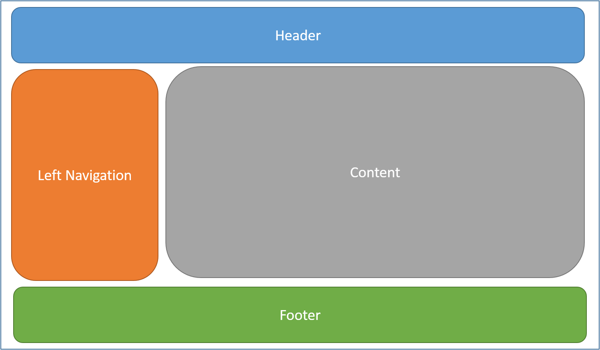

# MVC & WebAPI

**Models**: Data model
**Views**: UI Components
**Controllers**: Handle browser requests, retrieve model data then return a response
[Service Layer](https://learn.microsoft.com/en-us/aspnet/mvc/overview/older-versions-1/models-data/validating-with-a-service-layer-cs): Additional layer that separates validation logic from your controller

Ideas behind MVC:
- Separation of converns. E.G. Views don't handle business logic

### Controller

- MVC implements URL routing logic in this format: `/[Controller]/[ActionName]/[Parameters]`
- `public string Index()` : BaseURL method
- `MapControllerRoute` : URL template where you define parameters of a route
- Components of a route method
  - `IActionResult` : Interface for contracts that return the result of an action method. Generally return this or a something derived from ActionResult
  - `View` method : Renders the view
    - If the view is not specified, MVC defaults to using the view with the same name as the action method
    - E.G. `/HelloWorld/Index` --> `/Views/HelloWorld/Index.cshtml`
- **How to pass data from controllers to views?**
  - The preferred method is to use a View Model
  - **View Model** : Pass strongly typed models using the queryset as a parameter in the `View()` method. You can define the model to be passed to a view with a `@model` directive
  - Controllers can set `ViewData` K/V pairs which can be used in the Views through the `ViewData` dictionary. These models are not strongly typed.

### Views

- `Views/_ViewStart.cshtml` brings in shared layouts to each view
- [Layout](https://learn.microsoft.com/en-us/aspnet/core/mvc/views/layout?view=aspnetcore-6.0) : Reduce duplicated code in views by specifying common structure in a webpage
  - The default page is named `_Layout.cshtml` by convention
  - 
- Views should avoid doing business logic or interacting with the db directly

### Models

- DbContext

### Service Layer

### WebAPI

- Data Transfer Object (DTO)
- Visual studio makes creating CRUD APIs very easy. Just define a model then create a scaffold item to controller