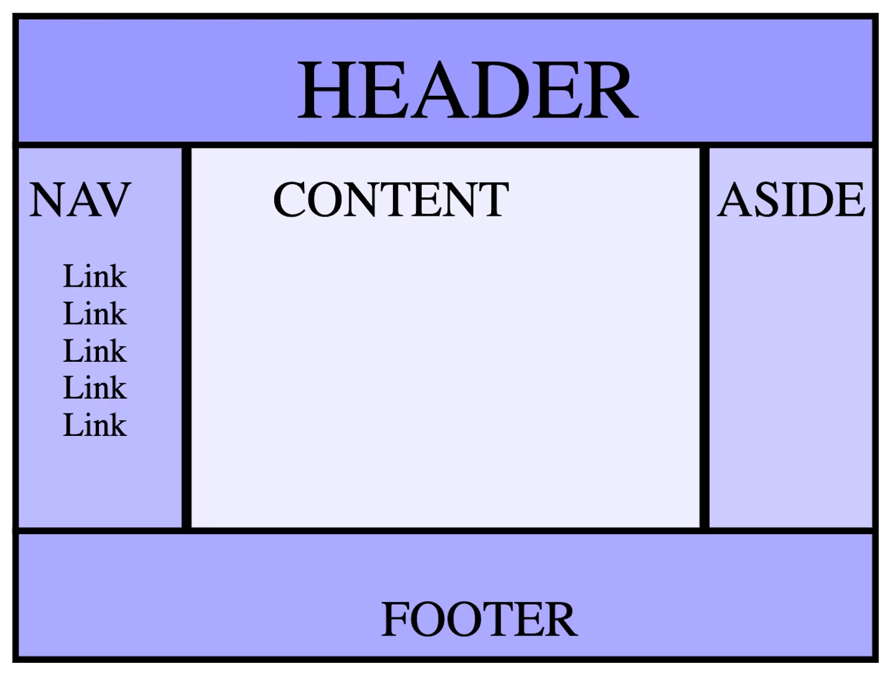

# HTML

Reviewing HTML to make an awesome animated webpage

https://web.dev/learn/html/overview/
https://isobar-us.github.io/code-standards/

### Isobar Frontend Code Standards for HTML

**Goals for markup**
- Maintain a clear separation o concerns, avoid in-line styles and in-line javascript whenever possible
- Build pages as a library of components, in such a way that blocks of code can be broken up and reused when implemented
- Use the most meaningful yet minimal markup to complete deliverables
- Have a reference implementation that each contributor knows what sort of structures are appropriate
  
**Before getting started**:
- Discuss the final delivery environment (mobile, desktop, etc)
- Templates and types of pages
- Which sections are reusable, which are managed by software vs by-hand
- Framewords, CSS grid systems
- Server-side delivery platforms

**What are the best practices?**
- Use semantic markup when possible
- Use the latest HTML5 markup specifications from W3C
- Include the proper doctype to trigger standards mode (`<!doctype html>` for html5)
- Define character encoding `<meta charset="UTF-8">`
- Use all open and closing elements nested in the correct ways to maximum compatibility and clarity of document structure
- [Valdiate your markup](https://validator.w3.org/)
- Use indentation appropriately
- Use quotes to surround all attribute values in HTML, despite quotes being optional in HTML5
- Use semantic names over descriptive names in `id` and `class` attributes
  - E.G. "secondary-nav" is better than "left-nav"
- All links should point to absolute or relative URLs with user-readable content. Don't link to XML or JSON designed to be AJAX'd with JS
- Use enclosed `<p>` tags to separate paragraphs instead of `<br>`
- Use definition lists `<dl>` to display a single record of name-value pairs
- Only use tables for tabular data, not page layout
- Make full use of the `<form>` tag for all sections requiring use input

**Next Steps:**
- Site maintenance procedures
- Browser testing strategies
- How new features will be added
- Where new features will be added
- What the file system looks like for static site assets
- If a CDN is involved
- Naming conventions and organization of graphics and photography assets
- If the "back-end implementation" of static HTML templates will require review by front-end team members


### Frontend Terminology

[Polyfill](https://remysharp.com/2010/10/08/what-is-a-polyfill): Piece of JS code that provides modern functionality in older browsers that do not natively support it

### Elements

**Elements**: Content nested between the opening and closing tags
 - Tag name is the content in the brackets

Types of elements:
- Non-Replaced: Have opening and optional closing tags that surround them. May include text, other tags as sub-elements
- Replaced: Can be replaced by options (such as a UI widget), image file or raster.
- Void element: Self closing tags, often denoted by `<tag />`
  - Most replaced elements are void elements but not all

**Tags** have attributes which define the behaviour, linkage and functionality of elements
- Most attributes are name/value pairs
- XHTML style markup: Style to use lowercase letters for all element and attribute names, self-closing empty elements  

Default appearance of **semantic elements** is set by user-agent stylesheets
- Semantic means "relating to meaning"
- Semantics of an element is important for search engines and assistive technologies
- Different browsers may have different user-agent stylesheets (elements may be rendered differently between browsers)

### Document Object Model (DOM)

**Nodes**: Javascript object is created by the browser for each element and section of text encountered

[HTML DOM API](https://developer.mozilla.org/en-US/docs/Web/API/HTML_DOM_API): Access and control each HTML element via the DOM 
- HTMLElement interface: represents HTML element and all descendent nodes

### Document Structure

- `<!DOCTYPE html>` doctype tells the browser to use standards mode
- `<html>` Root element
  - `lang` attribute: main ISO language + region
- **Head Element `<head>`:** Contains metadata such as search engine info, social media, icons, mobile screen shortcut, behaviour of the site
  - `charset` attribute: encoding
  - `<title>`
  - `<meta name="viewport" content="width=device-width" />`: Viewport metadata.
    - Above example makes the content the width of the screen
  - Including CSS
    - Use `<link>` with a `rel="stylesheet"` attribute, `<style>` to add css directly or the `style` attribute
    - Styles should go in the head because you want the browser to know how to render the content when it is loaded (prevents unnecessary repainting)
  - Favicon using `<link rel="icon" ...>`
  - Alternate versions for different languages `<link rel="alternate">`
    - For the authoritative source code use `<link rel="canonical"`
  - `<base target="_top" href="...">` sets the default link URL and target
    - Target: Where the links should open --> e.g. new window or new tab
- `<script>` tag Used to include scripts
  - Defaults to Javascript
  - Note: with JS, don't reference elements before they are created --> put scripts at the bottom of the `<body>` element if they reference other elements.
  - JS elements are render-blocking, and the browser stops downloading all assets when scripts are downloaded and doesn't resume until execution has completed
    - Can modify this behaviour with `defer` and `async`
- `<link>`: Link to fragment, url or downloadable resource
  - Download with `href="blob:downloadUrl" download="outputFilename"`
  - `target` attribute: 
    - `_self`: open link in current window
    - `_parent`: link nested in a parent object or iframe
    - `_blank`: open link in new tab
    - `_top`: top most ancestor
  - Can track link clicks using the `ping` attribute to ping a url on click
  - Tips for using Links
    - Provide enough information about the linked resource so the user knows what they're clicking on
    - Ensure links are different from regular text
    - use focus styles to enable keyboard navigators to know where they are when tabbing
    - Content between opening `<a>` and closing `</a>` is the default accessible name
    - Interactive content should not go in links (bad UX when loading)

### Metadata

- `<meta>` tag represents metadata that cannot be represented by  `<title>`, `<link>`, `<script>`, `<style>`, and the lesser used `<base>` in the `<head>` element
- Required tags are charset and viewport
- Attributes in meta tag `<meta name="attribute" content="">`:
  - `http-equiv` attribute in a `<meta>` tag: 
    - Has value as pragma directive which describes how a page should be parsed
    - most common value is refresh which sets timeout until page refresh
  - `description` attribute: used in SEO
  - `robots` attribute: tells bots to not index the site and follow links
  - `theme-color` attribute: 
  - Open graph: Controls how social media sites display your content
    - Specific social media sites may have their own similar syntaxes like Twitter (now X?)
- Manifest file: Prevent unwieldy header of many link and meta tags by defining them in a manifest file

### Semantic HTML

Using the correct HTML elements for your content
- **Accessibility object model (AOM**)
- `role` attribute: describes the role of an element in the context of the document
  - Semantic elements have implicit roles (such as header, main, footer as landmarks)
  - Role names are used to build the AOM

**Landmarks**: `<header>`, `<nav>`, `<main>`, `<aside>`, `<section>`, `<footer>`
- Use landmarks over roles or divs which improves the clarity of the document structure 
- `<header>`: has the banner role if the header is top-level otherwise a section header
  - Best to put your title, logo and main navigation here
- `<nav>`: identifies content as navigation


### Attributes

**Boolean, enumerated and global attributes**
- Global attributes:
  - `id`: Unique identifier that:
    - Target of a link's fragment identifier (goto fragment in page denoted by #id)
    - Identify an element for scripting `document.getElementById`
    - Associate a form element with its label using the `for` attribute
    - Providing a label or description for assistive technologies
    - Targetting styles in CSS (attribute selector)
  - `class`: Additional way of targetting elements with CSS and JS, but is not used by HTML
  - `aria-*`: Accessibility properties
  - `style`: style
  - `tabindex`: Recieve focus via tab key press
  - `role`: Part of ARIA spec covered earlier
  - `contenteditable`
- **Custom Attributes**: Create custom attributes by adding the `data-` prefix

### Text

Use `aria-labelledby` to turn headings into `region`s for accessibility

Quotes and citations: Use `<blockquote>`, `<q>` and `<cite>`
- `cite` attribute that is not readable to the user

HTML Entities: There are four reserved entities in HTML: `<, >, &, and "`. Their character references are `&lt;, &gt;, &amp; and &quot;` respectively.
- Symbols like &copy; and &trade;  are useful

### Navigation

- `<nav>` element: Informs navigation block
- Skip Link: Skip to the main content of the site when hitting tab
  - Hide content in the non-focused and non-active state using the selector `.visually-hidden:not(:focus):not(:active)`
  - Link text should be "skip to main" as the accessible name
- Table of contents: Make sure to wrap these lists in a `<nav>` element with an `aria-labelledby` attribute description
- Breadcrumbs: Provides links to each previous page a user has navigated through
  - E.G. `Home  / Learn / HTML  / Navigation` at the top of the page
  - `aria-label="breadcrumbs"` attribute in nav
  - Use landmark `role="list"` attribute in list
  - Don't link to the current page (bad UX for refresh) --> Denote using `aria-current="page"` attribute
- Global Navigation: The global header that links to other top-level paths of the site
  - Appears as the same nav on every page with `aria-current="page"` on any links to the current page 
  - `position="fixed"` to affix to the top of the page (what about `position: "sticky"`?)

### Conditional Rendering

- e.g. Render on custom attribute `data-complete` otherwise `display: none`
```css
.course .stack-nav a:not([data-complete="true"]) svg {
  display: none;
}
```

### Tables

Use **tables** for data that is being presented, compared, sorted, calculated or cross-referenced. Tables have a semantic meaning used by assistive technology for the aforementioned type of data.
- Alternative is to use lists styled with CSS; such as a grid of images if you want a neat layout
  - Grid layout without data requiring tables: Use CSS grid
  - Content in columns: Use multi-column layout 
- [Interactive slide deck explaining table elements](https://estelle.github.io/CSS/tables)
- Include aria `role` attributes when changing the CSS display property for table elements
  - Specify the `aria-sort` attribute in HTML if table column is sortable

**Table elements**
- `<thead>` Table head, `<tbody>` Table body and `<tfoot>` table footer
- `<caption>` captions are the preferred way of giving a name to a table
- `<colgroup>` `<col>` or `<tr>` `<th>` `<td>`
  
Apply styles to entire columns
- `<colgroup>` Defines groups of columns
  - `<col>` grouped by `<colgroup>`

Define and style individual rows, header cells and data cells
- Each table row `<tr>` contains one or more cells
- Cell headers use `<th>`, otherwise use `<td>`
  - `<th>` Header table cell: Use `scope="col/row"` attribute for accessibility
- `colspan` / `rowspan` attribute: use to merge adjacent cells

Example table usage
<table>
  <caption>MLW Alumni</caption>
  <thead>
    <tr>
      <th>Name</th>
      <th>Destiny</th>
      <th>Year</th>
    </tr>
  </thead>
  <tbody>
    <tr>
      <th>Hal Gibrah</th>
      <td>Calculator</td>
      <td>2020</td>
    </tr>
    <tr>
      <th>Cathy Terr</th>
      <td>Waste disposal</td>
      <td>2018</td>
    </tr>
    <tr>
      <th>Lou Minious</th>
      <td>Lightbulb</td>
      <td>1956</td>
    </tr>
  </tbody>
</table>

### Images

- Should contain a `src` and `alt` attribute at a minimum
  - Alt descriptions should be short, assuming you are describing the image to somebody who cannot see it (using a screen reader)
- Responsive Images: Use `srcset` attribute to include multiple image sources with associated media queries
  - Provides multiple version based on resolution, sizes attribute and the browser viewport size
  - `<picture>` element: Equivalent to defining `srcset`. Define sources with multiple `<source>` elements
- Set the `height` and `width` to avoid content layout shifts
  - These attributes will be overriden with CSS if setup correctly, however setting these attributes reserrves the space at the right aspect ratio and thus stops layout shifts 
- Lazy loading with the `lazy` attribute

### Audio and Video

`<video>` Element:
- Elements to include inside the opening and closing tags
  - Fallback content for what is loaded when the video fails
  - `<soruce>` Different sources can be specified (different media formats such as webm / ogg)
    - Formats specified by codecs parameter in `type` attribute of `source` element
  - `<tracks>` defines captions tracks for subtitles in [`WebVTT` format](https://developer.mozilla.org/en-US/docs/Web/API/WebVTT_API)
    - `kind` attribute --> Specify "subtitles", "description" or "caption"
    - "caption" value should be reserved for transcription with sound effects and other relevant audio information
    - Specify `srclang` attribute with "subtitles"
    - "description" is for textual descriptions of the visual content
  - `<poster>` element: Image displayed as a still shot before the video is played
- Make sure to define the aspect ratio in HTML to avoid reflows & repaints (specify height and width)
- Background video: Typically use `autoplay loop muted role="none"` attributes in video as these are not accessible (purely decorative videos)
  - Can improve performance by removing audio track from media sources
- `control` attribute adds media controls
  - Can override the browser's media controls

`<audio>` Element : Best for audio only

### Templates, Slot and Shadow

**Web Component standard**: Use HTML templates, custom elements and the shadow DOM to build customized, encapsulated and reusable elements in HTML/JS
- HTML Templates: `<template>` element used to declare fragments of HTML to be cloned and inserted into the DOM using Javascript
  - Contents of `<template>` are not written to the screen
  - `<slot>` Element allows you to inject your own markup into a template dynamically. Content inside the template will be distributed to the corresponding slot based on the slot names
  - The element within `<slot>` will be replaced by the element matching the slot name if specified

```html
<template id="star-rating-template">
  <form>
    <fieldset>
      <slot name="star-rating-legend">
        <legend>Rate your experience:</legend>
      </slot>
  ...
  <star-rating-template>
    <star-rating-legend> ...replacement here </star-rating-legend>
  </star-rating-template>
```
- [Custom Elements](https://developer.mozilla.org/en-US/docs/Web/API/Web_components/Using_custom_elements): The process you register a defined HTML element with the browser
  - Used to define new HTML elements with custom behaviour with JS
  - Register with [CustomElementRegistry.define()](https://developer.mozilla.org/en-US/docs/Web/API/CustomElementRegistry/define)
    - Requires name string, class that defines the behaviour, and optionally the parent class of the new element
  - These are NOT replacements for Javascript component frameworks (think React components)
  - [Best practices for custom elements](https://web.dev/custom-elements-best-practices/)
- Shadow DOM: Allows hidden DOM trees to be attached to elements in the regular DOM tree
  - CSS rules scoped to the regular DOM do not apply to the shadow DOM
  - Shadow boundary: Boundary where the shadow DOM ends and the regular DOM begins
  - Shadow DOM elements in a template can be edited with CSS using the `part` attribute from the global scope

Example Web Component
- Note: the `<rating>` element is undefined.
- Undefined Elements: Treated by the browser as anonymous inline elements that can be styled with css

```html
 <template id="star-rating-template">
   <form>
  <fieldset>
    <legend>Rate your experience:</legend>
     <rating>
       <input type="radio" name="rating" value="1" aria-label="1 star" required/>
       <input type="radio" name="rating" value="2" aria-label="2 stars"/>
       <input type="radio" name="rating" value="3" aria-label="3 stars"/>
       <input type="radio" name="rating" value="4" aria-label="4 stars"/>
       <input type="radio" name="rating" value="5" aria-label="5 stars"/>
     </rating>
    </fieldset>
    <button type="reset">Reset</button>
    <button type="submit">Submit</button>
</form>
</template>
```

Template defined can be drawn on the screen using the following JS by appending the contents of the `<template>` into the `<body>` 

```js
let starRating = document.getElementById("star-rating-template").content;
document.body.appendChild(starRating);
```

### HTML APIs

**What are HTML APIS?** Manipulating the DOM using Javascript.

Example uses include:
- Getting the attribute values of an element like "alt"
- Getting the layout details like `HTMLElement.offsetHeight` for the height of a section in the webpage, or the orientation of a mobile user's screen
- Getting the current UI state like mouse events or whether a video is playing

Pretty much every element has an associated DOM interface
- `Node` interface: Provides basic properties and methods inheried by all other DOM objects
  - Use to maintain the structure of a webpage by adding, removing or rearranging elements
- `Document` interface:  Represents entire web page and provides methods for creating, searching and manipulating elements
  - E.G.Query then attach event listeners to button click
- `HTMLDocument` interface: Implementation of document interface that provides additional methods for HTML documents like metadata editing or setting the title
- `Window` interface: Represents the browser window that contains the DOM document
  - E.G. Use for opening a new tab or popup
- `Element` interface: Represents a single element in the DOM, use for like getting or setting attributes

### Focus

- `tabindex` attribute should be set so that tabbing visually moves through the page
  - Negative value makes element focusable but not tabbable
- `contenteditable` attribute makes the element editable, tabbable and part of the tab order
- `disabled` attribute makes form controls unfocusable, and click events become void
- `inert` attribute diables content and removes it from the accessibility tree 

### Inline Text Elements

**Elements that provide text semantics for documentation**
- `<code>` element: <code>Code examples </code>
- `<pre>` element: <pre> Preformatted text</pre>
- `<data>` element: Machine readable translation <data>11000000</data>
- `<time>` element: has `datetime` attribute 
- `<sup>` and `<sub>` <sup>super</sup> and <sub>subscript</sub>
- `<kbd>`: <kbd>Keyboard input</kbd>
- `<dfn>`: <dfn lang="en">Definition</dfn>

**Text Emphasis:**
- `<em>`: <em>Emphasises span of content</em>
- `<mark>`: <mark>Highlight text such as marking the occurrence of search terms</mark>
- `<strong>`: <strong>Strong importance</strong>
- `<cite>`: <cite>Citation</cite>
- `<i>`: <i>Used for technical terms, foreign words, etc. Italicizes text</i> 
- `<u>`: <u>Content with non-textual annotation</u>
- `<b>`: <b>Draw attention to text with no semantic meaning</b>
- `<ruby>` Container to hold annotations for other written languages

**White Space:**
- `<br>`: Carriage return <br />
- `<hr>`: Horizontal rule used as a separator <hr></hr>
- `<wbr>`: Optionally break text if it overflows the container