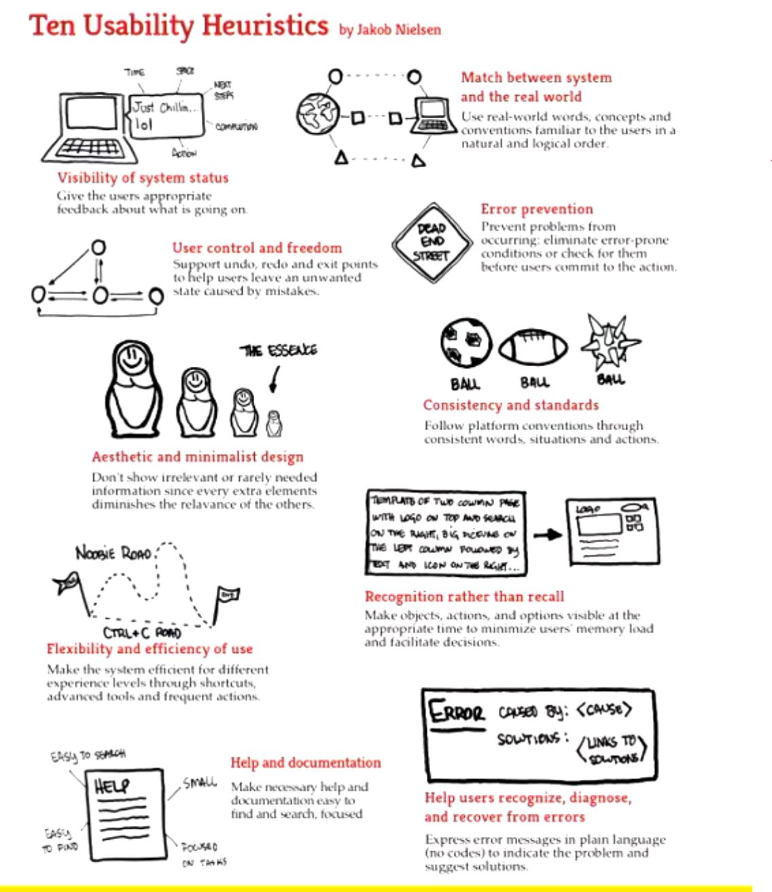

# Human Computer Interaction

Textbook: Interaction Design beyond human-computer interaction 6th Edition

What is **People-Centered Design**?
- Focus on the needs of "people". Envision exactly the kind of person who is using the application and HOW they are using it
- Design for human communication and interaction
- The experience when using the product is also key, in addition to the performance
- Accessibility and inclusivitiy

### Definitions and HCI Frameworks

These are all frameworks for evaluating user interfaces
- Design Principles: Generalised abstractions for thinking about the application design.
  - Gives you the dos and don'ts 
  - Derived from theory, experience and common sense
- Usability Heuristics: provide evaluation criteria to ensure that the design meets the needs of the end-user
  - Developed by jakob nielsen jacob nielsen
  - Described as heuristics because they are broad rules of thumb and not specific usability guidelines
- Usability Goals: What do you need to consider when designing a product?
- UX Goals: Words describing the experience that we want our users to have (satisfying, simple, fun, etc)
  

### Design Principles
Principles i may follow
- Simple is better and more elegant
- Digital products: No wait, remembers your preferences, easy access, digital records
- Products need to provide fedback about what has previously been done so the user knows what to do next
- Findability : Is it easy to discover the feature you want?
  - Structure and layout
- Navigability : Is it obvious what to do and where to go?
- visibility : How the interface is designed to show what someone needs to do next  
- feedback : Sending back information to communicate the result of a user's actions
  - Relates to visibility base
- constraints : Restrict the kinds of user interaction (e.g. by greying out disabled menus)
  - PREVENTS doing a task so there is no error
  - Semantic constraints: Considering real world conditions
    - E.G. Always choosing country -> state -> city when filling in a form
  - Logical Constraints: Using common sense
    - E.G. The text change button is greyed out until there is highlighted text to change
  - Cultural constraints: Socially acceptable behaviour
- consistency : Similar design elements for similar tasks
- affordance : Attributes of an object that let know you how to use it (e.g. you know to turn doorknobs)
  - E.G. It's obvious when a light switch needs to be flipped, and a doorknob should be turned
- Natural Mapping: Creating a spatial relationship between the controls and the outcome
  - E.G. Controls for an airplane seat have arrows on the seat itself and arrows on the backrest. The part of the seat that is moved by the controls is indicated by the space / symbols the controls are placed on

### Usability Heuristics

Proposed to evaluate usability of a product by UX experts not customers 
- 

### Usability Goals
What do you need to consider when designing a product?
- Effectiveness: How well does a product do what it is supposed to do. A system is designed to allow users to achieve their goals --> System is understood easily and provides the necessary features for users to accomplish their goal
- Efficiency: Number of actions to accomplish a task. Relates to removing unnecessary tasks (e.g. more system related tasks using keyboard shortcuts)
- Safety: Preventing errors and mistakes. Minimises harmful side effects for users
- Utility : The extent the product provides the right kind of functionbality (e.g. additional tools)
- Learnability : How easy is the product to learn (can you learn it without a guide?)
  - E.G. Sometimes this needs to be traded off for safety. Such as needing to pull two levers to activate boiling water
- Memorability : E.g. Using sequences of icons and verbose names to improve continued use. Where to find and how to work features when you open it for the SECOND time
- Satisfaction : Attention, pace, play, interactivity, conscious / unconscious control, narrative and flow.

### User Experience Goals

The user experience is subjective. Users may use adjectives to describe their experience
- 

What do UX designers do?
- User researcher: Collect and analyse user data to create a low fidelity prototype
- Usability analyst: Test the prototype
- Information architect: Plan user experience building wireframes
- Interaction designer: Design interactive elements like buttons
- Visual designer: Designs the look, feel, theme, graphical elements, etc.
- UX design: Jack of all trades

Conceptual Models: You need to consider the user's mental model of the application
- E.G. Conventions such as a home button on a phone, swipe down to get settings
- Symbols are important: When you see a scissors icon, you think of cutting. When you see a brush icon, you think you can draw.
  - Mail envelopes, cameras, trolley, magnifying glass --> These are all metaphors using real world objects as digital actions
- Copying is flattery 
- 