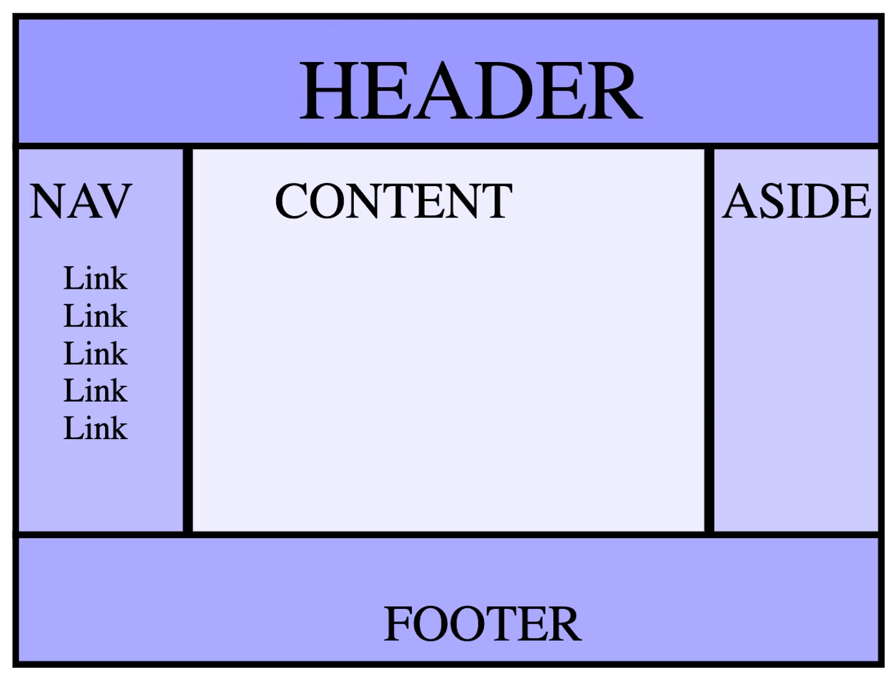

# HTML

Reviewing HTML to make an awesome animated webpage

https://web.dev/learn/html/overview/

### Elements

**Elements**: Content nested between the opening and closing tags
 - Tag name is the content in the brackets

Types of elements:
- Non-Replaced: Have opening and optional closing tags that surround them. May include text, other tags as sub-elements
- Replaced: Can be replaced by options (such as a UI widget), image file or raster.
- Void element: Self closing tags, often denoted by `<tag />`
  - Most replaced elements are void elements but not all

Tags have attributes which define the behaviour, linkage and functionality of elements
- Most attributes are name/value pairs
- XHTML style markup: Style to use lowercase letters for all element and attribute names, self-closing empty elements  

Default appearance of semantic elements is set by user-agent stylesheets
- Semantic means "relating to meaning"
- Semantics of an element is important for search engines and assistive technologies
- Different browsers may have different user-agent stylesheets (elements may be rendered differently between browsers)

### Document Object Model (DOM)

Nodes: Javascript object is created by the browser for each element and section of text encountered

[HTML DOM API](https://developer.mozilla.org/en-US/docs/Web/API/HTML_DOM_API): Access and control each HTML element via the DOM 
- HTMLElement interface: represents HTML element and all descendent nodes

### Document Structure

- `<!DOCTYPE html>` doctype tells the browser to use standards mode
- `<html>` Root element
  - `lang` attribute: main ISO language + region
- **Head Element `<head>`:** Contains metadata such as search engine info, social media, icons, mobile screen shortcut, behaviour of the site
  - `charset` attribute: encoding
  - `<title>`
  - `<meta name="viewport" content="width=device-width" />`: Viewport metadata.
    - Above example makes the content the width of the screen
  - Including CSS
    - Use `<link>` with a `rel="stylesheet"` attribute, `<style>` to add css directly or the `style` attribute
    - Styles should go in the head because you want the browser to know how to render the content when it is loaded (prevents unnecessary repainting)
  - Favicon using `<link rel="icon" ...>`
  - Alternate versions for different languages `<link rel="alternate">`
    - For the authoritative source code use `<link rel="canonical"`
  - `<base target="_top" href="...">` sets the default link URL and target
    - Target: Where the links should open --> e.g. new window or new tab
- `<script>` tag Used to include scripts
  - Defaults to Javascript
  - Note: with JS, don't reference elements before they are created --> put scripts at the bottom of the `<body>` element if they reference other elements.
  - JS elements are render-blocking, and the browser stops downloading all assets when scripts are downloaded and doesn't resume until execution has completed
    - Can modify this behaviour with `defer` and `async`
- `<link>`: Link to fragment, url or downloadable resource
  - Download with `href="blob:downloadUrl" download="outputFilename"`
  - `target` attribute: 
    - `_self`: open link in current window
    - `_parent`: link nested in a parent object or iframe
    - `_blank`: open link in new tab
    - `_top`: top most ancestor
  - Can track link clicks using the `ping` attribute to ping a url on click
  - Tips for using Links
    - Provide enough information about the linked resource so the user knows what they're clicking on
    - Ensure links are different from regular text
    - use focus styles to enable keyboard navigators to know where they are when tabbing
    - Content between opening `<a>` and closing `</a>` is the default accessible name
    - Interactive content should not go in links (bad UX when loading)

### Metadata

- `<meta>` tag represents metadata that cannot be represented by  `<title>`, `<link>`, `<script>`, `<style>`, and the lesser used `<base>` in the `<head>` element
- Required tags are charset and viewport
- Attributes in meta tag `<meta name="attribute" content="">`:
  - `http-equiv` attribute in a `<meta>` tag: 
    - Has value as pragma directive which describes how a page should be parsed
    - most common value is refresh which sets timeout until page refresh
  - `description` attribute: used in SEO
  - `robots` attribute: tells bots to not index the site and follow links
  - `theme-color` attribute: 
  - Open graph: Controls how social media sites display your content
    - Specific social media sites may have their own similar syntaxes like Twitter (now X?)
- Manifest file: Prevent unwieldy header of many link and meta tags by defining them in a manifest file

### Semantic HTML

Using the correct HTML elements for your content
- Accessibility object model (AOM)
- `role` attribute: describes the role of an element in the context of the document
  - Semantic elements have implicit roles (such as header, main, footer as landmarks)
  - Role names are used to build the AOM

Landmarks: `<header>`, `<nav>`, `<main>`, `<aside>`, `<section>`, `<footer>`
- Use landmarks over roles or divs which improves the clarity of the document structure 
- `<header>`: has the banner role if the header is top-level otherwise a section header
  - Best to put your title, logo and main navigation here
- `<nav>`: identifies content as navigation


### Attributes

Boolean, enumerated and global attributes
- Global attributes:
  - `id`: Unique identifier that:
    - Target of a link's fragment identifier (goto fragment in page denoted by #id)
    - Identify an element for scripting `document.getElementById`
    - Associate a form element with its label using the `for` attribute
    - Providing a label or description for assistive technologies
    - Targetting styles in CSS (attribute selector)
  - `class`: Additional way of targetting elements with CSS and JS, but is not used by HTML
  - `aria-*`: Accessibility properties
  - `style`: style
  - `tabindex`: Recieve focus via tab key press
  - `role`: Part of ARIA spec covered earlier
  - `contenteditable`
- Custom Attributes: Create custom attributes by adding the `data-` prefix

### Text

Use `aria-labelledby` to turn headings into `region`s for accessibility

Quotes and citations: Use `<blockquote>`, `<q>` and `<cite>`
- `cite` attribute that is not readable to the user

HTML Entities: There are four reserved entities in HTML: `<, >, &, and "`. Their character references are `&lt;, &gt;, &amp; and &quot;` respectively.
- Symbols like &copy; and &trade;  are useful

### Navigation

- `<nav>` element: Informs navigation block
- Skip Link: Skip to the main content of the site when hitting tab
  - Hide content in the non-focused and non-active state using the selector `.visually-hidden:not(:focus):not(:active)`
  - Link text should be "skip to main" as the accessible name
- Table of contents: Make sure to wrap these lists in a `<nav>` element with an `aria-labelledby` attribute description
- Breadcrumbs: Provides links to each previous page a user has navigated through
  - E.G. `Home  / Learn / HTML  / Navigation` at the top of the page
  - `aria-label="breadcrumbs"` attribute in nav
  - Use landmark `role="list"` attribute in list
  - Don't link to the current page (bad UX for refresh) --> Denote using `aria-current="page"` attribute
- Global Navigation: The global header that links to other top-level paths of the site
  - Appears as the same nav on every page with `aria-current="page"` on any links to the current page 
  - `position="fixed"` to affix to the top of the page (what about `position: "sticky"`?)

### Conditional Rendering

- e.g. Render on custom attribute `data-complete` otherwise `display: none`
```css
.course .stack-nav a:not([data-complete="true"]) svg {
  display: none;
}
```

### Tables

Use tables for data that is being presented, compared, sorted, calculated or cross-referenced. Tables have a semantic meaning used by assistive technology for the aforementioned type of data.
- Alternative is to use lists styled with CSS; such as a grid of images if you want a neat layout
  - Grid layout without data requiring tables: Use CSS grid
  - Content in columns: Use multi-column layout 
- [Interactive slide deck explaining table elements](https://estelle.github.io/CSS/tables)
- Include aria `role` attributes when changing the CSS display property for table elements

Table elements
- `<thead>` Table head, `<tbody>` Table body and `<tfoot>` table footer
- `<caption>` captions are the preferred way of giving a name to a table
- `<colgroup>` `<col>` or `<tr>` `<th>` `<td>`
  
Apply styles to entire columns
- `<colgroup>` Defines groups of columns
  - `<col>` grouped by `<colgroup>`

Define and style individual rows, header cells and data cells
- Each table row `<tr>` contains one or more cells
- Cell headers use `<th>`, otherwise use `<td>`
  - `<th>` Header table cell: Use `scope="col/row"` attribute for accessibility
- `colspan` / `rowspan` attribute: use to merge adjacent cells

Example table usage
<table>
  <caption>MLW Alumni</caption>
  <thead>
    <tr>
      <th>Name</th>
      <th>Destiny</th>
      <th>Year</th>
    </tr>
  </thead>
  <tbody>
    <tr>
      <th>Hal Gibrah</th>
      <td>Calculator</td>
      <td>2020</td>
    </tr>
    <tr>
      <th>Cathy Terr</th>
      <td>Waste disposal</td>
      <td>2018</td>
    </tr>
    <tr>
      <th>Lou Minious</th>
      <td>Lightbulb</td>
      <td>1956</td>
    </tr>
  </tbody>
</table>

