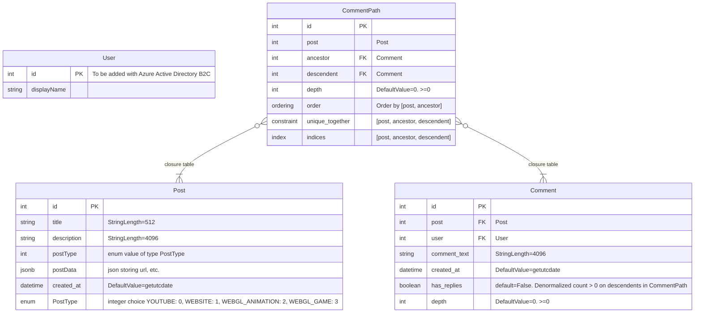

# Data Model

- Use singular not plural table names
- 

```mermaid
erDiagram
    User    {
        int id PK "To be added with Azure Active Directory B2C"
        string displayName
    }
    Post    {
        int id PK
        string title "StringLength=512"
        string description "StringLength=4096"
        int postType "enum value of type PostType"
        jsonb postData "json storing url, etc."
        datetime created_at "DefaultValue=getutcdate"
        enum PostType "integer choice YOUTUBE: 0, WEBSITE: 1, WEBGL_ANIMATION: 2, WEBGL_GAME: 3"
    }
    CommentPath }o--|{ Post : "closure table"
    CommentPath }o--|{ Comment : "closure table"
    Comment    {
    int id PK
    int post FK "Post"
    int user FK "User"
    string comment_text "StringLength=4096"
    datetime created_at "DefaultValue=getutcdate"
    boolean has_replies "default=False. Denormalized count > 0 on descendents in CommentPath"
    int depth "DefaultValue=0. >=0"
    }
    CommentPath   {
        int id PK
        int post "Post"
        int ancestor FK "Comment"
        int descendent FK "Comment"
        int depth "DefaultValue=0. >=0"
        ordering order "Order by [post, ancestor]"
        constraint unique_together "[post, ancestor, descendent]"
        index indices "[post, ancestor, descendent]"
    }

```